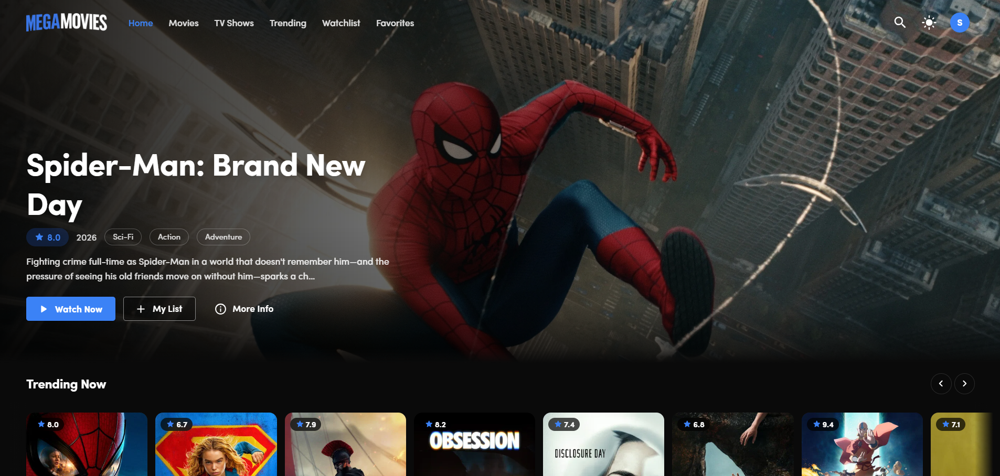

# MegaMovies — Movie & TV Discovery App

A Netflix-style movie and TV show discovery app built with React 19, Vite, Tailwind CSS v4, and Material UI, powered by the TMDB API. Browse trending titles, search instantly, watch trailers, and build your own watchlist and favorites — all saved per account in the browser.

## 🌐 Live Demo

🚀 **Live Website:** https://megamovies-webapp.netlify.app

## 📸 Screenshot

<p align="center">
  
</p>

## Features

### Browsing & Discovery
- Auto-rotating hero slider on the home page with trending titles and a one-click trailer
- Netflix-style horizontal rows — Trending Now, Popular, Top Rated, Upcoming, Now Playing, plus genre rows (Action, Comedy, Drama, Sci-Fi, Horror)
- Dedicated Movies page with category filters (Popular, Top Rated, Now Playing, Upcoming)
- TV Shows page with its own rows (Trending, Popular, Top Rated, Airing Today)
- Trending page with a Today / This Week toggle
- Infinite scroll — the next page loads automatically as you reach the bottom
- Instant search with a 500ms debounce, so typing doesn't fire an API call per keystroke

### Title Details
- Full detail page for both movies and TV shows — backdrop, poster, tagline, overview, genres, rating, runtime, status, language, budget and revenue
- Top-billed cast list
- YouTube trailer in a modal, opened from the hero, the detail page, or anywhere in the app
- "Similar titles" row for continued browsing
- All four detail requests (details, credits, videos, similar) fire in parallel via `Promise.all`

### Account & Personal Lists
- Demo sign-in with email or mobile number — no password, nothing verified, purely to separate one person's lists from another's
- Watchlist and Favorites, toggled from any poster card or from the detail page
- Every list is stored in `localStorage` under a key tied to the signed-in identity, so two people using the same browser never see each other's lists
- Session survives refresh and browser restart; signing out keeps your lists intact for the next time you sign in with the same email
- Auth state stays in sync across multiple open tabs via the `storage` event
- Protected routes — every page except the login screen requires a signed-in user

### Interface
- Dark and light theme with a toggle, remembered across sessions
- Skeleton loaders shaped like the real content for grids, rows and the detail page
- Toast notifications for list changes and sign-in/out
- Responsive across mobile, tablet and desktop, with a slide-out drawer on small screens
- Error and empty states with retry, plus a 404 page
- Self-hosted Sofia Pro font — no external font request at runtime

## Tech Stack

- **React 19** with Hooks
- **Vite 8** as the build tool
- **React Router 7** for routing, with `React.lazy` code splitting per page
- **Tailwind CSS v4** for layout and theming (via `@tailwindcss/vite`)
- **Material UI 7** for Buttons, Menus, Drawer, Dialog, Skeleton, Snackbar and Tooltip
- **Context API** for global state — five separate providers (Theme, Auth, UI, Movies, Lists)
- **TMDB REST API** for all movie and TV data
- **localStorage** for the signed-in user, watchlist, favorites and theme preference

## Project Structure

```text
10_Movie_Search_App/
├── public/                   
│   └── favicons + web manifest
│
└── src/
    ├── assets/               
    │   ├── fonts/            
    │   ├── logo-dark.png
    │   └── logo-light.png
    │
    ├── components/
    │   ├── common/           
    │   │   ├── EmptyState.jsx
    │   │   ├── ErrorBox.jsx
    │   │   ├── FilterTabs.jsx
    │   │   ├── Loader.jsx
    │   │   ├── Logo.jsx
    │   │   ├── PageHeader.jsx
    │   │   ├── ScrollToTop.jsx
    │   │   └── Skeletons.jsx
    │   ├── layout/           
    │   │   ├── Footer.jsx
    │   │   ├── MobileDrawer.jsx
    │   │   ├── Navbar.jsx
    │   │   └── Toaster.jsx
    │   └── movie/            
    │       ├── CastList.jsx
    │       ├── HeroBanner.jsx
    │       ├── HeroSlider.jsx
    │       ├── MovieCard.jsx
    │       ├── MovieGrid.jsx
    │       ├── MovieRow.jsx
    │       ├── SavedMoviesView.jsx
    │       └── TrailerModal.jsx
    │
    ├── context/              
    │   ├── AppProviders.jsx  
    │   ├── AuthContext.jsx   
    │   ├── ListContext.jsx   
    │   ├── MovieContext.jsx  
    │   ├── ThemeContext.jsx  
    │   └── UiContext.jsx     
    │
    ├── hooks/                
    │   ├── useDebounce.js
    │   ├── useInfiniteScroll.js
    │   ├── useMovieDetails.js
    │   └── usePaginatedList.js
    │
    ├── layouts/
    │   └── MainLayout.jsx    
    │
    ├── pages/                
    │   ├── Favorites.jsx
    │   ├── Home.jsx
    │   ├── Login.jsx
    │   ├── MovieDetails.jsx
    │   ├── Movies.jsx
    │   ├── NotFound.jsx
    │   ├── Search.jsx
    │   ├── Trending.jsx
    │   ├── TvShows.jsx
    │   └── Watchlist.jsx
    │
    ├── routes/
    │   ├── AppRoutes.jsx     
    │   └── ProtectedRoute.jsx
    │
    ├── services/             
    │   ├── api.js            
    │   └── movieService.js   
    │
    ├── styles/
    │   ├── index.css         
    │   └── muiTheme.js       
    │
    ├── utils/
    │   ├── constants.js
    │   └── helpers.js
    │
    ├── App.jsx
    └── main.jsx
```

## Getting Started

### Prerequisites

- Node.js (v18 or later)
- A free TMDB account with an API key

### 1. Clone the Repository

```bash
git clone https://github.com/sachin-codes01/Mini-Projects.git
```

```bash
cd Mini-Projects/10_Movie_Search_App
```

### 2. Install Dependencies

```bash
npm install
```

### 3. Add Your API Key

Create a `.env` file in the project root:

```env
TMDB_KEY=your_tmdb_api_key
```

Get a free key at [themoviedb.org/settings/api](https://www.themoviedb.org/settings/api).

### 4. Start the Dev Server

```bash
npm run dev
```

The application will be available at:

```text
http://localhost:5173
```

On first load you'll land on the sign-in screen. Enter any valid email or 10-digit mobile number — it's a demo sign-in, so no password is asked and nothing is verified.

## Available Scripts

```bash
npm run dev       # start the Vite dev server
npm run build     # production build into dist/
npm run preview   # preview the production build locally
npm run lint      # run ESLint across the project
```

## Environment Variables

```env
TMDB_KEY=your_tmdb_api_key
```

> The `.env` file is excluded from version control using `.gitignore`. Note there's no `VITE_` prefix — the key is only read server-side (by the Netlify Function and the Vite dev-server proxy), so it's never bundled into the client JS. When deploying, set `TMDB_KEY` in your hosting provider's environment variables.

## Notes

- **This is a demo sign-in, not real authentication.** No password is asked, nothing is sent to a server, and nothing is verified. It exists only so that each email gets its own watchlist and favorites. Real Google OAuth would need a Google Cloud client ID and a backend to verify the token.
- **All data lives in the browser.** Your account, lists and theme are stored in `localStorage`, which means they are per-device and per-browser. Clearing site data clears them.
- **TMDB calls go through a Netlify Function proxy** (`netlify/functions/tmdb.js`) instead of being called directly from the browser. This keeps the API key out of the client bundle and avoids client-side ISP blocks on `api.themoviedb.org`.

## Tech Highlights

- Context API state management split across five focused providers
- Route-level code splitting with `React.lazy` and `Suspense`
- Custom hooks for pagination, infinite scroll, debouncing and detail fetching
- Per-account `localStorage` persistence with cross-tab sync
- Protected routes with automatic redirect to sign-in
- Parallel API requests with `Promise.all`
- `IntersectionObserver`-based infinite scroll
- Dark/light theming shared between Tailwind and MUI through CSS variables
- Responsive `auto-fill` grid that keeps posters aligned with headings at any screen width
- `React.memo` on cards and rows to avoid re-rendering hundreds of posters
- Self-hosted fonts via `@font-face` for offline-capable typography

## Author

**Sachin Kumar**
[github.com/sachin-codes01](https://github.com/sachin-codes01)

## License

This project is for personal and educational purposes. Feel free to fork and modify it for learning.

Movie and TV data provided by [TMDB](https://www.themoviedb.org/). This product uses the TMDB API but is not endorsed or certified by TMDB.
